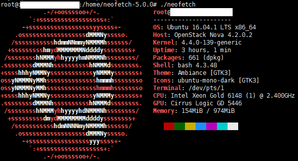

## 服务器环境搭建

#### 使用服务器环境

使用neofetch查看系统信息：



#### 安装.NET Core

注册微软密钥
```
wget -q https://packages.microsoft.com/config/ubuntu/16.04/packages-microsoft-prod.deb
sudo dpkg -i packages-microsoft-prod.deb
```

安装.NET SDK
```
sudo apt-get install apt-transport-https
sudo apt-get update
sudo apt-get install dotnet-sdk-2.1
```

安装完成查看是否安装成功：


#### nginx反向代理

安装nginx：

```
apt install nginx
```

配置nginx:


重新加载nginx：

```
nginx -t
nginx -s reload
```
nginx其它命令
```
nginx -s reload   # 重新载入配置文件
nginx -s reopen   # 重启 Nginx
nginx -s stop     # 停止 Nginx
```

#### Supervisor

安装supervisor：

```
apt install supervisor
```

安装完成之后，在 /ect/supervisor/confg.d/ 目录下新建一个配置文件，取名为 albertdemo.conf (当前项目的名称)


各项配置解释：
```
[program:TestCore]
command=dotnet TestCore.dll #要执行的命令
directory=/home/xx/TestCore #命令执行的目录
environment=ASPNETCORE__ENVIRONMENT=Production #环境变量
user=www-data #进程执行的用户身份
stopsignal=INT
autostart=true #是否自动启动
autorestart=true #是否自动重启
startsecs=1 #自动重启间隔
stderr_logfile=/var/log/TestCore.err.log #标准错误日志
stdout_logfile=/var/log/TestCore.out.log #标准输出日志
```

重新加载配置：

```
service supervisor stop
service supervisor start
```