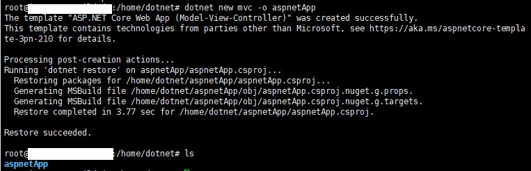
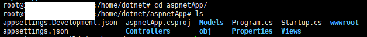
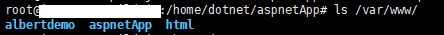

## 配置多站点


使用dotnet命令创建mvc程序

```
dotnet new mvc -o aspnetApp
```



创建成功，生成名为aspnetApp的文件夹，进入文件夹：



修改程序监听端口，默认5000、5001已经在另外的程序中使用，执行命令：

```
vi Properties/launchSettings.json
```
修改：


保存退出。

生成、发布程序，执行指令：
```
dotnet run
```


可以看见程序启动监听成功，`Ctrl+C`推出程序，执行指令：
```
dotnet publish
```


可以发现发布文件路径为`/home/dotnet/aspnetApp/bin/Debug/netcoreapp2.1/publish/`

拷贝文件到`/var/www/`中：
```
cp bin/Debug/netcoreapp2.1/publish /var/www -r
mv /var/www/publish /var/www/aspnetApp
```
查看复制结果：



