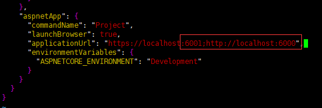
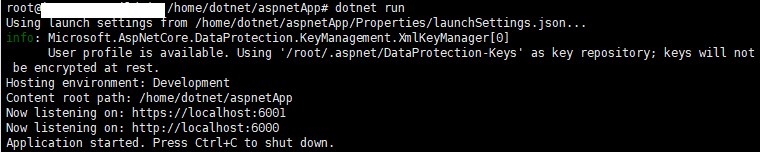
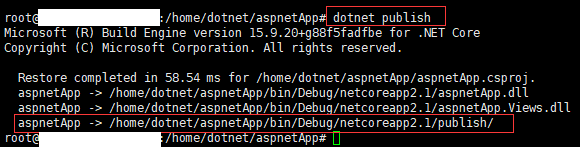

## 配置多站点


使用dotnet命令创建mvc程序

```
dotnet new mvc -o aspnetApp
```


创建成功，生成名为aspnetApp的文件夹，进入文件夹：


修改程序监听端口，默认5000、5001已经在另外的程序中使用，执行命令：

```
vi Properties/launchSettings.json
```
修改：



保存退出。

生成、发布程序，执行指令：
```
dotnet run
```



可以看见程序启动监听成功，`Ctrl+C`推出程序，执行指令：
```
dotnet publish
```



可以发现发布文件路径为`/home/dotnet/aspnetApp/bin/Debug/netcoreapp2.1/publish/`

拷贝文件到`/var/www/`中：
```
cp bin/Debug/netcoreapp2.1/publish /var/www -r
mv /var/www/publish /var/www/aspnetApp
```
查看复制结果：


使用supervisor来管理应用，添加配置：


```
[program:aspnetApp]
command=dotnet aspnetApp.dll
directory=/var/www/aspnetApp
environment=ASPNETCORE_ENVIRONMENT="Development"
environment=ASPNETCORE_URLS="http://localhost:5000"
user=root
stopsignal=INT
autostart=true
autorestart=true
startsecs=1
stderr_logfile=/var/log/aspnetApp.err.log
stdout_logfile=/var/log/aspnetApp.out.log
```

新应用的监听端口设置为5000，添加nginx代理配置，现在回头查看nginx的配置，查看nginx配置目录`/etc/nginx`，


这里面的`nginx.conf`就是默认的配置文件，使用cat命令查看内容：
```
root@xxxxx:/etc/nginx# cat nginx.conf 
```
```
user www-data;
worker_processes auto;
pid /run/nginx.pid;

events {
	worker_connections 768;
	# multi_accept on;
}

http {

	##
	# Basic Settings
	##

	sendfile on;
	tcp_nopush on;
	tcp_nodelay on;
	keepalive_timeout 65;
	types_hash_max_size 2048;
	# server_tokens off;

	# server_names_hash_bucket_size 64;
	# server_name_in_redirect off;

	include /etc/nginx/mime.types;
	default_type application/octet-stream;

	##
	# SSL Settings
	##

	ssl_protocols TLSv1 TLSv1.1 TLSv1.2; # Dropping SSLv3, ref: POODLE
	ssl_prefer_server_ciphers on;

	##
	# Logging Settings
	##

	access_log /var/log/nginx/access.log;
	error_log /var/log/nginx/error.log;

	##
	# Gzip Settings
	##

	gzip on;
	gzip_disable "msie6";

	# gzip_vary on;
	# gzip_proxied any;
	# gzip_comp_level 6;
	# gzip_buffers 16 8k;
	# gzip_http_version 1.1;
	# gzip_types text/plain text/css application/json application/javascript text/xml application/xml application/xml+rss text/javascript;

	##
	# Virtual Host Configs
	##

	include /etc/nginx/conf.d/*.conf;
	include /etc/nginx/sites-enabled/*;
}


#mail {
#	# See sample authentication script at:
#	# http://wiki.nginx.org/ImapAuthenticateWithApachePhpScript
# 
#	# auth_http localhost/auth.php;
#	# pop3_capabilities "TOP" "USER";
#	# imap_capabilities "IMAP4rev1" "UIDPLUS";
# 
#	server {
#		listen     localhost:110;
#		protocol   pop3;
#		proxy      on;
#	}
# 
#	server {
#		listen     localhost:143;
#		protocol   imap;
#		proxy      on;
#	}
#}
```

一般来说，除非有特别需求，我们不会修改nginx.conf文件里面的内容。在上面的配置中可以注意到：
```
include /etc/nginx/conf.d/*.conf;
```

不难看到这个配置出现在Server节点内部，所以还是对本站点配置起作用的。这个conf.d目录存放的是对于所有Server节点通用性的功能，其存在的意义就是能让我们少写一些重复性的配置内容。而是抽取出来，放到一个通用的目录下。

这里为aspnetApp添加nginx的server配置：


这里配置的外部监听端口为`8081`，在上面的supervisor中配置的内部监听端口为5000，这里配置对应。

重新加载nginx：

```
nginx -s reload
```

通过浏览器访问通过IP和8081端口访问：


访问成功！！同时原有的网站也能够访问成功。按照这个思路可以将原有应用的nginx从default中抽取出来，这里为了访问简单直接通过80端口默认访问不做抽取。