## 更新发布

#### 发布文件系统
选择Albert.Demo项目，右键点击发布，选择文件系统发布

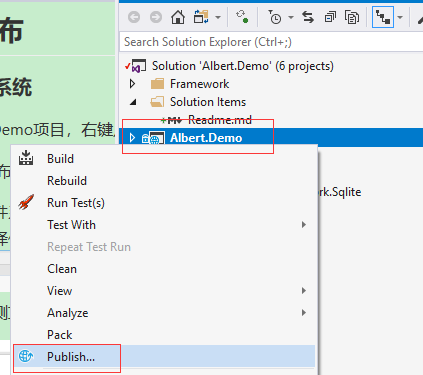

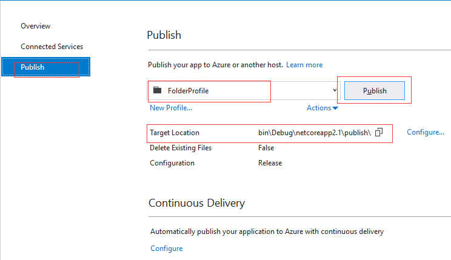

注意发布的文件的路径。

#### 上传文件到服务器

通过ftp将发布的文件夹上传到服务器
1. 选择文件系统文件夹
2. 右键选择传输，在下方可以查看上传进度
    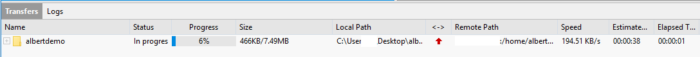
3. 查看右侧文件

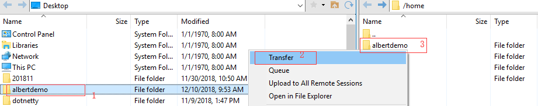

这里将文件系统上传到`/home`文件夹中，在控制台通过命令查看文件夹

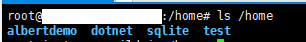

#### 更新程序

首先使用命令`ps -aux`查看进程：
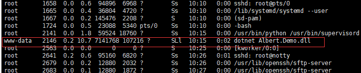

可以看见旧版本的程序在运行中。

由于程序是通过Supervisor进行管理的，这里需要先停止supervisor：

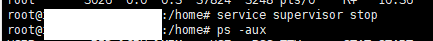

然后查看进程，发现程序已经停止运行。如果使用kill命令，发现是不能够杀死进程的。

这里可以通过supervisor的配置查看进程配置，配置在文件路径`/etc/supervisor/conf.d/`下：

可以看见`albertdemo`的配置文件，查看配置文件内容：

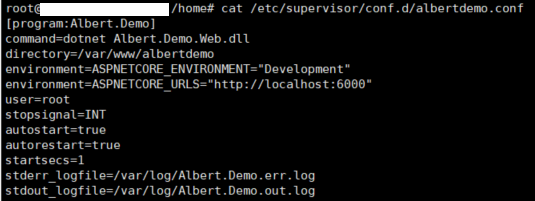

从配置文件中可以看见应用部署路径为：
> directory=/var/www/albertdemo

清空`/var/www/albertdemo`的内容：

查看`/var/www/albertdemo`已被清空，接下来复制新的文件系统：

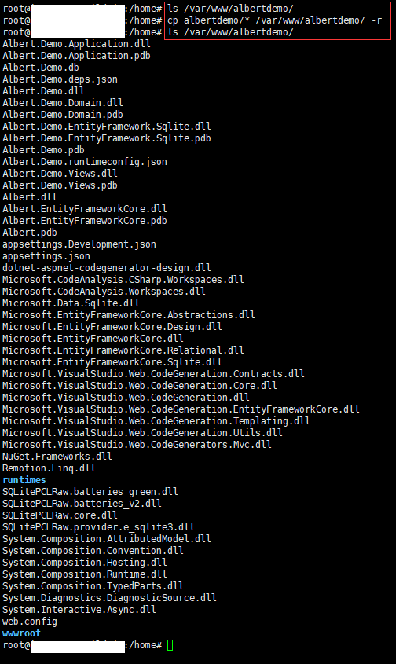

可以看见新的文件内容已经复制到部署路径中，接下来启动supervisor：

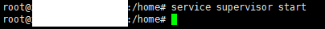

使用命令`ps -aux`查看进程：

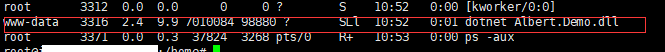

可以看见程序已经启动！！！

接下来使用浏览器输入网址查看网站信息：

可以看见新的网页已经部署成功！！