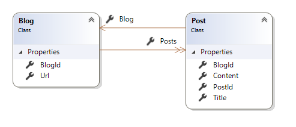

#### 关系

关系定义了两个实体之间如何关联到对方。在关系型数据库中，这通过外键约束来表示。

>**注意：**
>
>这篇文章中的绝大多数的示例通过一对多的关系来演示这个概念。一对一、多对多的关系查看文章末尾的`Other Relationship Patterns`。

##### 定义条款

这里有一组条款来描述关系
* Dependency entity(依赖实体)：包含了外键属性的实体。有时被称为关系中的'child'
* Principan entity(主实体)：包含主键/备用键属性的实体。有时被视为关系中的'parent'
* Foreign key：依赖实体中用于保存关联实体主键属性值的属性
* Principal key：主实体中的唯一标识属性，可以是主键或者备用键
* Navigation property：在主实体、依赖实体中定义的包含关联实体引用的属性
   * Collection navigation property：包含多个关联实体引用的导航属性
   * Reference navigation property：保存单个关联实体引用的导航属性
   * Inverse navigation property：当讨论一个特殊的导航属性，这个条款指。。。。。

```csharp
public class Blog
{
    public int BlogId { get; set; }
    public string Url { get; set; }

    public List<Post> Posts { get; set; }
}

public class Post
{
    public int PostId { get; set; }
    public string Title { get; set; }
    public string Content { get; set; }

    public int BlogId { get; set; }
    public Blog Blog { get; set; }
}
```
上面的代码展示了Blog和Post之间的一对多的关系
* Post 依赖实体
* Blog 主实体
* Post.BlogId 外键
* Blog.BlogId 主键(在这个例子中更像一个主键，而不是备用键)
* Post.Blog 一个引用的导航属性
* Blog.Posts 包含多个引用的导航属性

代码图：



##### 约定

约定，当在一个类型中发现存在导航属性，对应的关系就会被创建。如果属性所指向的类型不能被当前数据库提供程序映射为标量类型，则将其视为导航属性。

>**提示：**
>
>通过约定发现的关系通常指向主实体的主键。要指向备用键，则必须使用Fluent API执行额外配置。

###### 完全定义的关系

关系最常见的模式是在关系的两端都定义导航属性，并在依赖实体定义外键属性。
* 如果在两个类型中发现一对导航属性，那么它们将被配置为具有相同关系的反向导航属性。
* 如果依赖实体包含命名为`<primary key property name>`, `<navigation property name><primary key property name>`, 或者 `<principal entity name><primary key property name>`，那么它将会被配置为外键。

```csharp
public class Blog
{
    public int BlogId { get; set; }
    public string Url { get; set; }

    public List<Post> Posts { get; set; }
}

public class Post
{
    public int PostId { get; set; }
    public string Title { get; set; }
    public string Content { get; set; }

    public int BlogId { get; set; }
    public Blog Blog { get; set; }
}
```

>**注意：**
>
>如果在两个类型中定义了多个导航属性(也就是说，不知一对相互指向的导航)，按照约定不会创建关系，需要手动配置确定导航属性如何配对。

###### 没有外键属性

尽管建议在依赖实体类中定义外键属性，但是不是必须的。如果没有外键属性被找到，将会引入名为`<navigation property name><principal key property name>`的影子外键属性(获取更多信息，查看影子属性)。

```csharp
public class Blog
{
    public int BlogId { get; set; }
    public string Url { get; set; }

    public List<Post> Posts { get; set; }
}

public class Post
{
    public int PostId { get; set; }
    public string Title { get; set; }
    public string Content { get; set; }

    public Blog Blog { get; set; }
}
```

###### 单一导航属性
只包含一个导航(没有反向导航，也没有外键属性)属性足以通过约定方式定义关系，也可以只有一个单一导航属性和一个外键属性。

```csharp
public class Blog
{
    public int BlogId { get; set; }
    public string Url { get; set; }

    public List<Post> Posts { get; set; }
}

public class Post
{
    public int PostId { get; set; }
    public string Title { get; set; }
    public string Content { get; set; }
}
```

###### 层叠删除 cascade delete

按照惯例，cascade delete将被设置为用于所需关系的cascade, ClientSetNull用于可选关系。cascade意味着依赖实体也会被删除。ClientSetNull意味着未加载到内存中的依赖实体将保持不变，必须手动删除，或更新为指向有效主体实体。对于加载到内存中的实体。EF Core将尝试将外键属性设置为null。

##### 数据注解

`[ForeignKey]` 和 `[InverseProperty]`两中数据注解可以用来配置关系。

###### [ForeignKey]

可以使用该注解来配置属性为给定关系中外键。这种情况通常在按照约定没有外键属性被发现的情况。

```csharp
public class Blog
{
    public int BlogId { get; set; }
    public string Url { get; set; }

    public List<Post> Posts { get; set; }
}

public class Post
{
    public int PostId { get; set; }
    public string Title { get; set; }
    public string Content { get; set; }

    public int BlogForeignKey { get; set; }

    [ForeignKey("BlogForeignKey")]
    public Blog Blog { get; set; }
}
```

>**Tip:**
>
>[ForeignKey]注释可以放在关系中的任意一个导航属性上。它不需要存在于依赖实体的导航属性中。

###### [InverseProperty]

使用该注解来配置依赖和主实体的导航属性如何配对。这通常在两个实体类型中存在一对以上导航属性时使用。

```csharp
public class Post
{
    public int PostId { get; set; }
    public string Title { get; set; }
    public string Content { get; set; }

    public int AuthorUserId { get; set; }
    public User Author { get; set; }

    public int ContributorUserId { get; set; }
    public User Contributor { get; set; }
}

public class User
{
    public string UserId { get; set; }
    public string FirstName { get; set; }
    public string LastName { get; set; }

    [InverseProperty("Author")]
    public List<Post> AuthoredPosts { get; set; }

    [InverseProperty("Contributor")]
    public List<Post> ContributedToPosts { get; set; }
}
```

##### Fluent API

要使用Fluent API配置关系，首先要标识用来建立关系的导航属性。`HasOne` or `HasMany`用来表示将要配置的实体类型中的导航属性。然后使用链接调用`WithOne` or `WithMany`来标识反向导航。`HasOne`/`WithOne`用于单个导航属性引用，`HasMany`/`WithMany`用于导航属性集合。

```csharp
class MyContext : DbContext
{
    public DbSet<Blog> Blogs { get; set; }
    public DbSet<Post> Posts { get; set; }

    protected override void OnModelCreating(ModelBuilder modelBuilder)
    {
        modelBuilder.Entity<Post>()
            .HasOne(p => p.Blog)
            .WithMany(b => b.Posts);
    }
}

public class Blog
{
    public int BlogId { get; set; }
    public string Url { get; set; }

    public List<Post> Posts { get; set; }
}

public class Post
{
    public int PostId { get; set; }
    public string Title { get; set; }
    public string Content { get; set; }

    public Blog Blog { get; set; }
}
```

###### 单一导航属性

如果只有一个导航属性，这里就会有`WithOne` and `WithMany`的无参重载。这表明在关系的另一端存在概念上的引用或集合，但是实体中不包含导航属性。

```csharp
class MyContext : DbContext
{
    public DbSet<Blog> Blogs { get; set; }
    public DbSet<Post> Posts { get; set; }

    protected override void OnModelCreating(ModelBuilder modelBuilder)
    {
        modelBuilder.Entity<Blog>()
            .HasMany(b => b.Posts)
            .WithOne();
    }
}

public class Blog
{
    public int BlogId { get; set; }
    public string Url { get; set; }

    public List<Post> Posts { get; set; }
}

public class Post
{
    public int PostId { get; set; }
    public string Title { get; set; }
    public string Content { get; set; }
}
```

###### 外键

使用Fluent API配置属性为给定关系中需要被用作外键属性。

```csharp
class MyContext : DbContext
{
    public DbSet<Blog> Blogs { get; set; }
    public DbSet<Post> Posts { get; set; }

    protected override void OnModelCreating(ModelBuilder modelBuilder)
    {
        modelBuilder.Entity<Post>()
            .HasOne(p => p.Blog)
            .WithMany(b => b.Posts)
            .HasForeignKey(p => p.BlogForeignKey);
    }
}

public class Blog
{
    public int BlogId { get; set; }
    public string Url { get; set; }

    public List<Post> Posts { get; set; }
}

public class Post
{
    public int PostId { get; set; }
    public string Title { get; set; }
    public string Content { get; set; }

    public int BlogForeignKey { get; set; }
    public Blog Blog { get; set; }
}
```

下面的代码展示如何配置复合外键。

```csharp
class MyContext : DbContext
{
    public DbSet<Car> Cars { get; set; }

    protected override void OnModelCreating(ModelBuilder modelBuilder)
    {
        modelBuilder.Entity<Car>()
            .HasKey(c => new { c.State, c.LicensePlate });

        modelBuilder.Entity<RecordOfSale>()
            .HasOne(s => s.Car)
            .WithMany(c => c.SaleHistory)
            .HasForeignKey(s => new { s.CarState, s.CarLicensePlate });
    }
}

public class Car
{
    public string State { get; set; }
    public string LicensePlate { get; set; }
    public string Make { get; set; }
    public string Model { get; set; }

    public List<RecordOfSale> SaleHistory { get; set; }
}

public class RecordOfSale
{
    public int RecordOfSaleId { get; set; }
    public DateTime DateSold { get; set; }
    public decimal Price { get; set; }

    public string CarState { get; set; }
    public string CarLicensePlate { get; set; }
    public Car Car { get; set; }
}
```

可以通过`HasForeignKey(...)`的string重载配置一个影子属性作为外键。建议在使用影子属性作为外键，先将其显示的添加到模型中(如下所示)：

```csharp
class MyContext : DbContext
{
    public DbSet<Blog> Blogs { get; set; }
    public DbSet<Post> Posts { get; set; }

    protected override void OnModelCreating(ModelBuilder modelBuilder)
    {
        // Add the shadow property to the model
        modelBuilder.Entity<Post>()
            .Property<int>("BlogForeignKey");

        // Use the shadow property as a foreign key
        modelBuilder.Entity<Post>()
            .HasOne(p => p.Blog)
            .WithMany(b => b.Posts)
            .HasForeignKey("BlogForeignKey");
    }
}

public class Blog
{
    public int BlogId { get; set; }
    public string Url { get; set; }

    public List<Post> Posts { get; set; }
}

public class Post
{
    public int PostId { get; set; }
    public string Title { get; set; }
    public string Content { get; set; }

    public Blog Blog { get; set; }
}
```

###### Principal Key

如果希望外键引用主键以外的属性，可以使用Fluent API为关系配置principal key。配置为principal key的属性会自动被设置为备用键(alternate key)

```csharp
class MyContext : DbContext
{
    public DbSet<Car> Cars { get; set; }

    protected override void OnModelCreating(ModelBuilder modelBuilder)
    {
        modelBuilder.Entity<RecordOfSale>()
            .HasOne(s => s.Car)
            .WithMany(c => c.SaleHistory)
            .HasForeignKey(s => s.CarLicensePlate)
            .HasPrincipalKey(c => c.LicensePlate);
    }
}

public class Car
{
    public int CarId { get; set; }
    public string LicensePlate { get; set; }
    public string Make { get; set; }
    public string Model { get; set; }

    public List<RecordOfSale> SaleHistory { get; set; }
}

public class RecordOfSale
{
    public int RecordOfSaleId { get; set; }
    public DateTime DateSold { get; set; }
    public decimal Price { get; set; }

    public string CarLicensePlate { get; set; }
    public Car Car { get; set; }
}
```

下面的代码展示如何配置组合principal key

```csharp
class MyContext : DbContext
{
    public DbSet<Car> Cars { get; set; }

    protected override void OnModelCreating(ModelBuilder modelBuilder)
    {
        modelBuilder.Entity<RecordOfSale>()
            .HasOne(s => s.Car)
            .WithMany(c => c.SaleHistory)
            .HasForeignKey(s => new { s.CarState, s.CarLicensePlate })
            .HasPrincipalKey(c => new { c.State, c.LicensePlate });
    }
}

public class Car
{
    public int CarId { get; set; }
    public string State { get; set; }
    public string LicensePlate { get; set; }
    public string Make { get; set; }
    public string Model { get; set; }

    public List<RecordOfSale> SaleHistory { get; set; }
}

public class RecordOfSale
{
    public int RecordOfSaleId { get; set; }
    public DateTime DateSold { get; set; }
    public decimal Price { get; set; }

    public string CarState { get; set; }
    public string CarLicensePlate { get; set; }
    public Car Car { get; set; }
}
```

>**注意：**
>
>指定principal key属性的顺序必须与为外键指定它们的顺序相匹配。

###### 必须和可选关系

可以使用Fluent API类配置关系时必须的或可选的。最终，它控制外键属性时必须的或可选的。这在使用影子状态外键时是很有用的。如果实体类中有一个外键属性，那么关系的可选性取决于外键属性是必须的或者可选的。

```csharp
class MyContext : DbContext
{
    public DbSet<Blog> Blogs { get; set; }
    public DbSet<Post> Posts { get; set; }

    protected override void OnModelCreating(ModelBuilder modelBuilder)
    {
        modelBuilder.Entity<Post>()
            .HasOne(p => p.Blog)
            .WithMany(b => b.Posts)
            .IsRequired();
    }
}

public class Blog
{
    public int BlogId { get; set; }
    public string Url { get; set; }

    public List<Post> Posts { get; set; }
}

public class Post
{
    public int PostId { get; set; }
    public string Title { get; set; }
    public string Content { get; set; }

    public Blog Blog { get; set; }
}
```

###### 层叠删除

可以使用Fluent API显示配置给定关系的层叠删除的行为

在Saving Data一节查看Cascade Delete各选项的详细讨论

```csharp
class MyContext : DbContext
{
    public DbSet<Blog> Blogs { get; set; }
    public DbSet<Post> Posts { get; set; }

    protected override void OnModelCreating(ModelBuilder modelBuilder)
    {
        modelBuilder.Entity<Post>()
            .HasOne(p => p.Blog)
            .WithMany(b => b.Posts)
            .OnDelete(DeleteBehavior.Cascade);
    }
}

public class Blog
{
    public int BlogId { get; set; }
    public string Url { get; set; }

    public List<Post> Posts { get; set; }
}

public class Post
{
    public int PostId { get; set; }
    public string Title { get; set; }
    public string Content { get; set; }

    public int? BlogId { get; set; }
    public Blog Blog { get; set; }
}
```

##### 其它关系模式

###### 一对一

一对一关系在两边都有一个引用导航属性。它们遵循与一对多关系相同的约定，但是在外键属性上引入了唯一索引，以确保只有一个依赖项与每个主体关联。

```csharp
public class Blog
{
    public int BlogId { get; set; }
    public string Url { get; set; }

    public BlogImage BlogImage { get; set; }
}

public class BlogImage
{
    public int BlogImageId { get; set; }
    public byte[] Image { get; set; }
    public string Caption { get; set; }

    public int BlogId { get; set; }
    public Blog Blog { get; set; }
}
```

>**注意：**
>
>EF根据检测外键属性的能利选择一个实体作为依赖项。如果错误的实体被选作依赖项，可以使用Fluent API进行更正。

在使用Fluent API配置关系是，使用`HasOne` and `WithOne` 方法.

在配置外键时，需要指明依赖实体的类型--注意下面代码中提供给`HasForeignKey`的泛型参数。在一对多关系中，显然具有引用导航的是依赖项，具有集合的是主体。但这在一对一关系中并非如此--因此需要显示定义

###### 多对多

尚不支持没有实体类来表示连接表的多对多关系。但是，可以通过为联接表包含实体类并映射两个单独的一对多关系来表示多对多关系。

```csharp
class MyContext : DbContext
{
    public DbSet<Post> Posts { get; set; }
    public DbSet<Tag> Tags { get; set; }

    protected override void OnModelCreating(ModelBuilder modelBuilder)
    {
        modelBuilder.Entity<PostTag>()
            .HasKey(t => new { t.PostId, t.TagId });

        modelBuilder.Entity<PostTag>()
            .HasOne(pt => pt.Post)
            .WithMany(p => p.PostTags)
            .HasForeignKey(pt => pt.PostId);

        modelBuilder.Entity<PostTag>()
            .HasOne(pt => pt.Tag)
            .WithMany(t => t.PostTags)
            .HasForeignKey(pt => pt.TagId);
    }
}

public class Post
{
    public int PostId { get; set; }
    public string Title { get; set; }
    public string Content { get; set; }

    public List<PostTag> PostTags { get; set; }
}

public class Tag
{
    public string TagId { get; set; }

    public List<PostTag> PostTags { get; set; }
}

public class PostTag
{
    public int PostId { get; set; }
    public Post Post { get; set; }

    public string TagId { get; set; }
    public Tag Tag { get; set; }
}
```