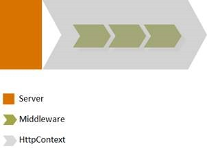
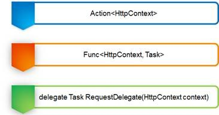
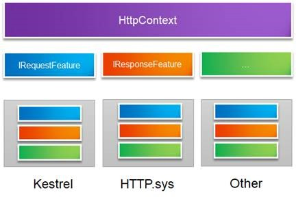
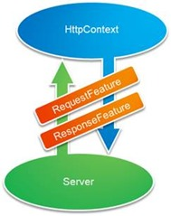

## Aspnet core Mini Tutorial

Tutorial from [Artech cnblog](https://www.cnblogs.com/artech/p/inside-asp-net-core-framework.html)

ASP.NET Core **Pipeline = Server + Middlewares**

---
#### Seven core object

---
##### 1.HttpContext

---
##### 2.RequestDelegate

---
##### 3.Middleware

---
##### 4.ApplicationBuilder

---
##### 5.Server

---
##### HttpContext and Server adapter

---
##### 6.WebHost

---
##### 7.WebHostBuilder
